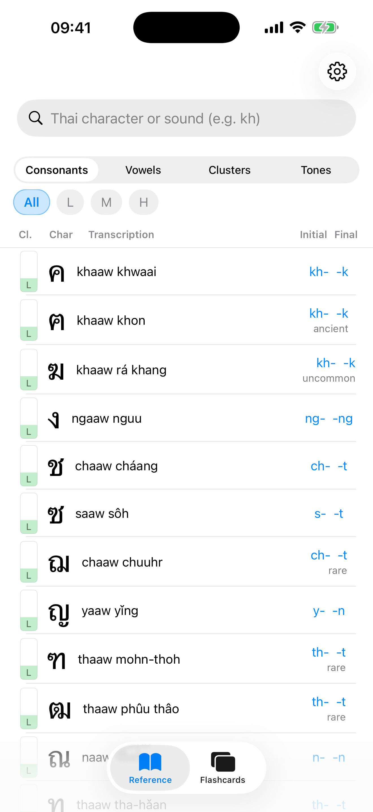
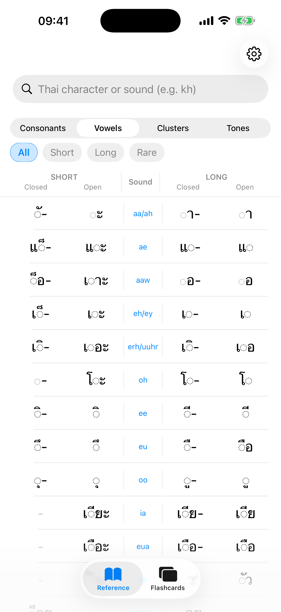
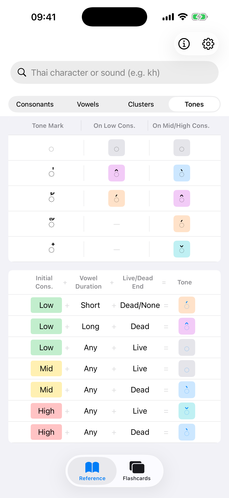
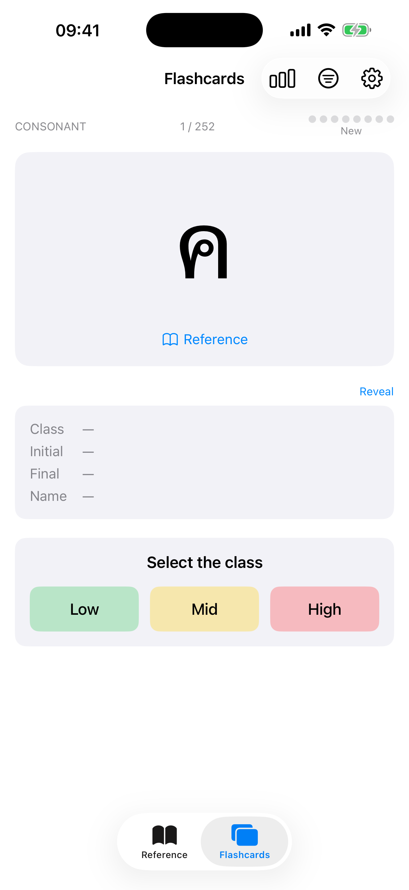

# ThaiSheet

An open-source iOS quick reference to help you learn to read Thai, based on a comprehensive cheatsheet.

App Store release preparation is tracked in [APP_STORE_METADATA.md](APP_STORE_METADATA.md).

## Screenshots

| Reference | Vowels | Tones | Flashcards |
|---|---|---|---|
|  |  |  |  |

More (dark mode, French, iPad) in [docs/screenshots/](docs/screenshots/), also shown on the [website](https://cmontpetit.github.io/ThaiSheet/).

## Features

- **Reference Browser** - Browse consonants, vowels, tone rules, tone marks, and clusters with search and filtering
- **Audio Playback** - Hear pronunciation for characters and syllables
- **Complementary Flashcards** - Practice what you look up with multiple-choice questions, using a Wanikani-style spaced repetition system with 8 progression stages
- **Smart Card Selection** - Choose between intelligent SRS-based ordering or sequential study
- **Customizable Filters** - Focus on specific consonant classes, vowel types, or tone rules
- **Progress Tracking** - Detailed statistics showing mastery levels across all card types
- **Optional iCloud Sync** - Sync learning progress and settings across devices when enabled
- **Localized** - Available in English and French, with easy community translation support

## Requirements

- iOS 17.0+
- Xcode 16+

## Build & Run

```bash
# Build for simulator
xcodebuild -project ThaiSheet.xcodeproj -scheme ThaiSheet \
  -destination 'platform=iOS Simulator,name=iPhone 17' build

# Run tests
xcodebuild -project ThaiSheet.xcodeproj -scheme ThaiSheet \
  -destination 'platform=iOS Simulator,name=iPhone 17' test

# Verify an App Store release build has no coverage instrumentation
scripts/check_release_binary.sh /path/to/ThaiSheet.app
```

## Sound Generation

Sound files are generated with [Google Cloud Text-to-Speech](https://cloud.google.com/text-to-speech). First-time setup:

```bash
cd scripts && python3 -m venv venv && source venv/bin/activate && pip install -r requirements.txt
gcloud auth application-default login
```

After setup, activate the virtual environment and run:

```bash
source scripts/venv/bin/activate
python3 scripts/generate_sounds.py --all --dry-run --check-files
python3 scripts/generate_sounds.py --all --force --normalize-lufs -18 --check-files
# Or specific types: --consonants, --vowels, --tone-marks, --tone-rules
```

The default generation voice is `th-TH-Neural2-C`. The current bundled vowel
pronunciation words use `th-TH-Chirp3-HD-Kore`; the remaining recorded set uses
Neural2-C. Use an explicit `--voice-name` when producing a replacement set.
Generated responses are rejected and retried when they are too short or nearly
silent. Loudness normalization includes a true-peak limit to avoid clipping.
Within one generation run, exact duplicate synthesis inputs reuse the first
processed response so their MP3 files are byte-identical.
Candidate sets can be written safely below `scratchpad/` with `--output-dir` and
compared with the bundled set using `scripts/generate_sound_review.py`.

To review the real-word vowel pronunciation mapping, build the dedicated
73-variant page. It uses the existing
per-form sample words as initial candidates and compares their candidate voice
recordings with the bundled vowel-word recordings:

```bash
python3 scripts/generate_vowel_pronunciation_review.py \
  --candidate-dir scratchpad/kore-candidate
```

Review decisions are stored locally in the browser and can be exported as JSON.
Forms without a defensible real-word candidate remain explicitly unvoiced.
The page also flags unusually long or internally segmented one-word responses,
which can indicate that a generative TTS voice added or repeated speech.

The public [pronunciation catalog](https://cmontpetit.github.io/ThaiSheet/sounds.html)
is generated from the same canonical inventory. After changing JSON data, audio,
or recorded-voice metadata, update and verify it with:

```bash
python3 scripts/generate_sound_catalog.py
python3 scripts/generate_sound_catalog.py --check
```

When previewing `docs/sounds.html` locally, serve the repository root (rather
than only `docs/`) so the catalog can play audio from the working tree.

## Data & Audio Provenance

The bundled learning data (`ThaiSheet/Resources/cheatsheet/*.json`) is an independent
compilation of factual information about the Thai script — character inventory,
consonant classes, sounds, tone rules — expressed in this project's own structure and
wording, with corrections and additions by the author. No third-party images, prose,
or artwork are included.

All pronunciation audio was generated with
[Google Cloud Text-to-Speech](https://cloud.google.com/text-to-speech) (see Sound
Generation above).

## Contributing

See [CONTRIBUTING.md](.github/CONTRIBUTING.md) for guidelines on how to contribute, including how to add translations for new languages.

## Privacy

ThaiSheet does not include analytics, ads, tracking, or third-party SDKs. Learning progress and settings are stored locally with UserDefaults. If iCloud Sync is enabled, the app syncs learning progress and settings through Apple's iCloud key-value store.

See [PRIVACY.md](PRIVACY.md) for the full privacy policy draft.

## Support

Use [GitHub Issues](https://github.com/cmontpetit/ThaiSheet/issues) for bug reports and feature requests once the repository is public. See [SUPPORT.md](SUPPORT.md) for details.

## License

This project is licensed under the MIT License. See [LICENSE](LICENSE) for details.
